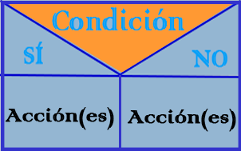
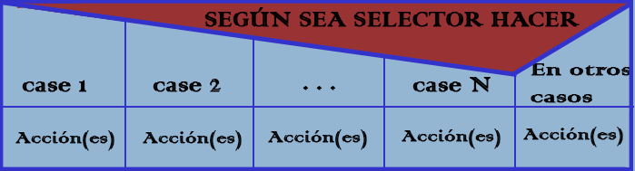
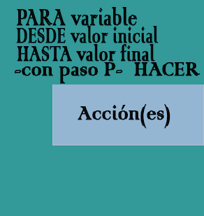

# EL-ALGORITMO-SEGÚN-EL-DIAGRAMA-NASSI-SCHNEIDERMAN
Diagrama Nassi-Shneiderman

* Marca el inicio del Algoritmo:

* Marca el fin del Algoritmo

* Marca una salida de datos (ESCRITURA):

* Marca la entrada de datos (LECTURA):

* Marca un proceso secuencial (Asignación, Operación, Cambio de valor de celda en memoria, etc ):

* Marca una decisión SI/ENTONCES:

* Marca una decisión SI/ENTONCES/SINO:

* Marca una decisión múltiple sin default cases:

* Marca una decisión múltiple con default cases:

* Marca una repetición de 0 a N veces (MIENTRAS):

* Marca una repetición de 1 a N veces (REPETIR HASTA):

* Marca una repetición de 1 a N veces (DESDE - HASTA):

# Se puede usar:

* Programa PSeInt.

