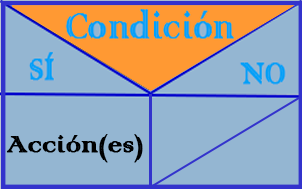
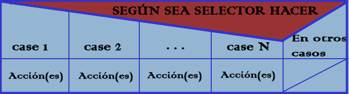

# EL-ALGORITMO-SEGUN-EL-DIAGRAMA-NASSI-SCHNEIDERMAN
Diagramas Nassi-Shneiderman

* Marca el inicio y el fin del Algoritmo:

* Marca la entrada de datos (LECTURA):

* Marca un proceso (Asignación, Operación, Cambio de valor de celda en memoria, etc ):

* Marca una salida de datos (ESCRITURA):

* Marca una decición SI/ENTONCES (también utilizado en estructuras repetitivas MIENTRAS y REPETIR):

* Marca una decición SI/ENTONCES/SINO:

* Marca una decisión múltiple:

# Se puede usar:

* Programa Visio->Formas para diagramas de flujo para Seis Sigma.

